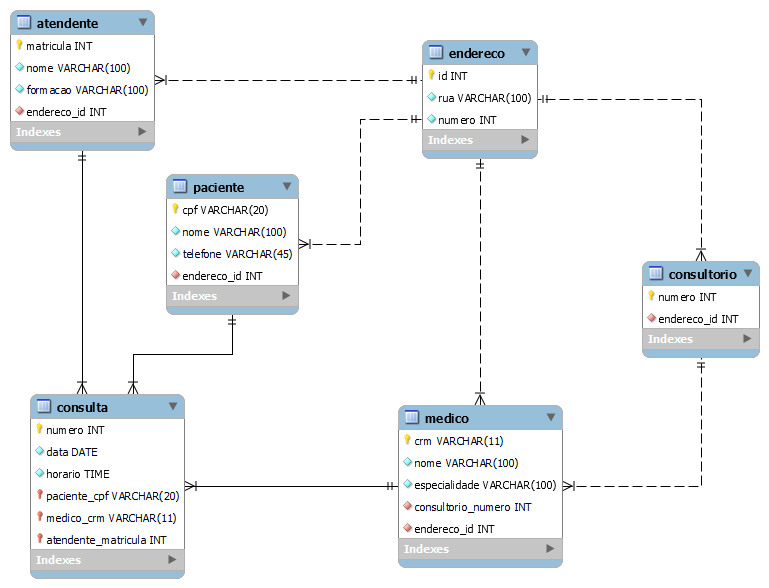
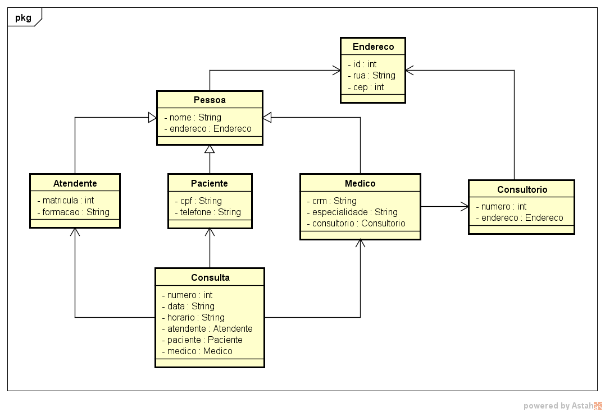

# Projeto Java - Clínica Médica

## Objetivo

Este projeto foi desenvolvido para testes de persistência com o banco de dados usando Netbeans ou Visual Studio Code.

## Requisitos do sistema

Ações do sistema: <u>listar</u>, <u>inserir</u>, <u>alterar</u> e <u>excluir</u>.

* Cadastro de atendente, paciente, endereço, medico, consultório e consulta;

* consulta, alteração e exclusão da tabela "atendente";
* consulta, alteração e exclusão da tabela "paciente";
* consulta, alteração e exclusão da tabela "endereco";
* consulta, alteração e exclusão da tabela "medico";
* consulta, alteração e exclusão da tabela "consultorio";
* consulta, alteração e exclusão da tabela "consulta";

## Modelo Relacional

## Diagrama de Classes

## Banco de Dados

* nome do banco: technostore

tabela **atendente**
campo | tipo | tamanho | auto incremento | chave primária | default/expression
:---: | :---: | :---: | :---: | :---: | :---:
matricula | int | 11 | não | sim |
nome | varchar | 100 | não | não |
formacao | varchar | 100 | não | não |
endereco_id | int | 11 | não | sim | on update cascade on delete cascade

tabela **paciente**
campo | tipo | tamanho | auto incremento | chave primária | default/expression
:---: | :---: | :---: | :---: | :---: | :---:
cpf | varchar | 20 | não | sim |
nome | varchar | 100 | não | não |
telefone | varchar | 45 | não | não |
enderecco_id | int | 11 | não | sim | on update cascade on delete cascade

tabela **endereco**
campo | tipo | tamanho | auto incremento | chave primária
:---: | :---: | :---: | :---:| :---:
id | int | 11 | não | sim
rua | varchar | 100 | não | não
numero | int | 11 | não | não

tabela **medico**
campo | tipo | tamanho | auto incremento | chave primária | default/expression
:---: | :---: | :---: | :---: | :---: | :---:
crm | varchar | 11 | não | sim |
nome | varchar | 100 | não | não |
especialidade | varchar | 100 | não | não
consultorio_numero | int | 11 | não | sim | on update cascade on delete cascade
endereco_id | int | 11 | não | sim | on update cascade on delete cascade

tabela **consultorio**
campo | tipo | tamanho | auto incremento | chave primária | default/expression
:---: | :---: | :---: | :---: | :---: | :---:
numero | int | 11 | não | sim |
endereco_id | int | 11 | não | sim | on update cascade on delete cascade

tabela **consulta**
campo | tipo | tamanho | auto incremento | chave primária | default/expression
:---: | :---: | :---: | :---: | :---: | :---:
numero | int | 11 | não | sim
data | date |  | não | não
horario | time |  | não | não
paciente_cpf | varchar | 20 | não | sim | on update cascade on delete cascade
medico_crm | varchar | 11 | não | sim | on update cascade on delete cascade
atendente_matricula | int | 11 | não | sim | on update cascade on delete cascade
